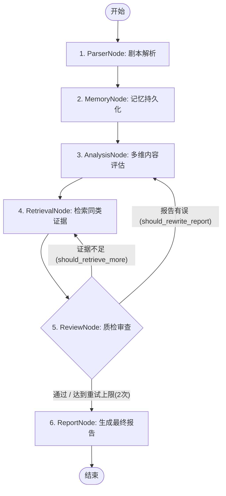
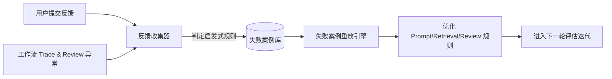

# 面向影视立项决策的多 Agent 协同剧本评估系统

一个面向影视、短剧内容立项决策场景，具备**高度可控性**、**可追溯性**与**可评估性**的多 Agent 协同评估与质检系统。本系统通过状态机控制的混合工作流 (Hybrid Workflow) 实现了 Parser、Memory、Analysis、Retrieval 和 Review 节点的深度协同，旨在解决大模型在长文本评估中容易出现的“前后矛盾”、“幻觉编造”以及“无依据主观评价”等工程痛点。

---

## 1. 产品背景：内容立项决策场景

在影视剧本、微短剧等内容制作中，立项评估（Greenlight Decision）是一项高风险决策。评估不仅需要对剧本文本进行内容拆解，更需要结合政策红线、制作预算以及同题材市场历史表现进行综合评估。

传统的剧本评估工作流严重依赖人工阅读，存在**评估主观性强、决策周期长、不同评估人员标准不一致**的痛点。AI 辅助决策工具的引入必须是**严谨、合规且可追溯**的，单纯依靠单轮 Prompt 的直接输出无法满足 B 端商业决策的安全性和逻辑深度要求。

---

## 2. 为什么不是单轮 Prompt？

直接使用单轮长 Prompt（即“请评估以下剧本”）在实际工程落地中存在以下致命缺陷：

1. **幻觉与自相矛盾**：LLM 在单次生成长文本报告时，缺乏自检机制，容易出现“前文指出制作预算风险极高，最终建议却给出直接通过”的逻辑冲突。
2. **主观偏见溢出**：缺乏角色职责划分，LLM 容易输出情绪化、空泛的主观定性词汇（如“垃圾剧本”、“人设不行”），无法将评估得分与剧本原文证据或检索市场对标硬性绑定。
3. **不可修正的单向流**：在遇到证据缺失、格式校验失败或违反人设设定约束时，单向 Prompt 无法回滚、重新检索或重写，导致系统容错率极低。

### 多 Agent 协同的工程解决方案
本系统摒弃了“单 Prompt 直出”模式，采用 **Multi-Agent 协同架构**：
- 将**客观事实提取**（Parser）与**主观价值评估**（Analysis）进行物理职责隔离，设定严格的提取红线。
- 引入**本地 RAG 检索器**（Retrieval）为市场匹配度评分注入真实数据支撑。
- 引入**独立审计节点**（Review）对草稿报告进行逻辑与偏见质检，并在检测出缺陷时打回自环修正。

---

## 3. 系统架构与 Hybrid Workflow 工作流

系统采用**外层确定性 Pipeline 保证业务合规、内层局部自环允许 ReAct 补充修正**的 **Hybrid Workflow** 架构。

### 1. 确定性外层流程 (Outer Deterministic Flow)
外层工作流是一个确定性的顺序流程，首个生命周期严格按照以下顺序执行各节点，以防模型随意跳过关键合规节点：
1. **ParserNode**：解析剧本，客观提取角色人设与事件序列；
2. **MemoryNode**：将抽取的人物与项目初始信息注册进入持久化记忆库；
3. **AnalysisNode**：多维度评估剧本质量、亮点和风险，生成报告草稿；
4. **RetrievalNode**：利用 TF-IDF 与题材 Boost 检索本地相似作品作为证据；
5. **ReviewNode**：独立核对评估草稿中的逻辑、幻觉和证据质量；
6. **ReportNode**：锁定并输出最终校验格式报告。

### 2. 局部补充自环修正 (Inner Correction Loop)
在 `ReviewNode` 质检过程中，内层逻辑通过评估报告中的反馈控制标志位控制状态路由回退：
- **打回检索 (`should_retrieve_more == True`)**：当发现检索证据不足或对标不匹配时，打回至 `RetrievalNode`。流转路径：`RetrievalNode` $\rightarrow$ `AnalysisNode` $\rightarrow$ `ReviewNode`；
- **打回重新分析 (`should_rewrite_report == True`)**：当发现人设冲突或评分无依据时，打回至 `AnalysisNode`。流转路径：`AnalysisNode` $\rightarrow$ `ReviewNode`；
- **重试上限保护 (Retry Limit)**：质检迭代最大次数限制为 **2 次**。一旦达到重试上限，系统会自动锁定并流转至 `ReportNode` 生成报告，坚决杜绝无限循环。

### 3. 工作流状态图 (Workflow Diagram)


---

## 4. Agent 角色分工

| Agent 角色 | 核心职责 | 输入 | 输出 | 约束红线 |
| :--- | :--- | :--- | :--- | :--- |
| **Parser Agent**<br>(解析抽取) | 从剧本梗概中提取客观事实要素 | 剧本输入 `ScriptInput` | 结构化要素 `ScriptAnalysis` | **坚决不做主观质量评价**，亮点/缺点/风险点字段一律置空。 |
| **Analysis Agent**<br>(评估打分) | 进行多维度打分并给出可落地的具体集数修改建议 | 事实 `ScriptAnalysis`、检索证据 `RetrievalEvidence` | 评估草稿 `FinalReport` | 评分必须附带理由；建议必须指明具体集数（如“在第 1 集结尾...”），拒绝空泛大词。 |
| **Retrieval Agent**<br>(证据检索) | 匹配本地素材库，寻找相似作品为市场表现作对标支撑 | 剧本要素与核心冲突 | 相似作品列表 `RetrievalEvidence` | 不作法律层面的抄袭检测或侵权判定，定位为“市场对标依据”。 |
| **Review Agent**<br>(质检核对) | 独立上下文检查报告逻辑矛盾、主观偏见、人物关系错误等 | 剧本原文、分析事实、检索证据、评估草稿 | 问题列表 `List[ReviewIssue]`，以及自环控制标志位 | 不要只输出“通过/不通过”；每个缺陷必须提供 claim、reason 及 suggested_fix 三要素。 |

---

## 5. 核心工程设计

### 1. 双重系统记忆模块 (Memory Design)
为了在长周期的剧本打磨与多轮修改评估中保持设定一致性，系统实现了双重记忆持久化存储：
- **项目决策记忆 (`ProjectMemoryStore`)**：归档特定项目历次评估产出的 `FinalReport` 历史。支持多轮评估的版本回溯与局部更新，供 `/projects/{project_id}` 接口进行报告还原。
- **角色人设记忆 (`CharacterMemoryStore`)**：在 Parser 阶段抽取完人设后批量写入。锁定特定角色的动机、标签及最重要的**人设约束条件**（`constraints`），防范多轮评估中角色背景坍塌。

### 2. 本地 RAG 证据检索 (Retrieval Engine)
系统实现了一个纯 Python 轻量级本地 RAG 检索器，支持无依赖运行：
- **算法原理**：使用字符级 TF-IDF 余弦相似度计算文本距离。
- **题材与标签 Boost**：若 Query 完美命中题材（`genre`）或标签（`tags`），触发相似度 Boost 奖励得分（最高 0.7 叠加），使相似题材对标作品排位前移。
- 检索返回的 `RetrievalEvidence` 会被强行绑定在评估报告的 executive_summary 中，以保证市场打分的客观性。

### 3. Review Agent 复核机制 (Quality Audit)
Review Agent 在独立上下文内运行 6 种维度的启发式检测规则，拦截有瑕疵的报告：
1. `unsupported_claim` (无依据评价)：检测评分理由是否未绑定任何原文证据或 RAG 对标作品。
2. `character_inconsistency` (人设不一致)：检测修改建议是否引导角色违反了记忆库中登记的 `constraints`（例如：设定约束为“不杀人”，报告却建议“在第 X 集击杀反派”）。
3. `wrong_relation` (人物关系错误)：比对报告中描述的人物关系词与事实抽取的关系库。
4. `hallucinated_event` (编造人物/情节)：检测是否引用了剧本中根本不存在的虚拟人名或胡乱编造的 Sensational 事件（如“车祸”、“穿越”等）。
5. `weak_suggestion` (修改建议太空泛)：拦截如“加强人物塑造”、“直接开机”等字符极短或没有指明具体集数的空泛口号建议。
6. `evidence_mismatch` (证据不匹配)：拦截悬疑题材剧本强行对标《流浪地球》等科幻重工业作品且无合理技术解释的配置。

---

## 6. Eval 指标和运行方式

为客观衡量多 Agent 工作流的优势，系统构建了可量化评估指标系统，利用基准测试样本真实计算，杜绝虚假数字。

> [!WARNING]
> **关于评测指标的免责声明 / Warning Disclaimer**：
> 当前系统所有 Agent 节点和工具底层的推理均采用 Mock LLMs（启发式规则 and 模拟延迟）进行，因此评估报告中产出的指标（如平均延迟 `avg_latency_ms`、对标精准度 `evidence_precision` 等）**仅用于流程闭环与数据结构验证**。它们仅体现系统各模式的工程结构差异，并不代表真实生产环境下大语言模型（如 Gemini 或 GPT-4）的真实性能、准确度上限与延迟表现。

### 1. 评估指标定义与物理意义
- **JSON 成功率 (`json_success_rate`)**：输出成功反序列化并校验为 `FinalReport` 的概率，衡量数据结构的稳定性。
- **人物抽取准确率 (`character_extraction_accuracy`)**：提取角色与黄金角色（Gold Characters）的 Jaccard 相似度，衡量 Parser 实体的抽取召回率。
- **核心冲突准确率 (`core_conflict_accuracy`)**：提取的核心冲突与黄金标注在字符级别的 Jaccard 重合度，衡量文本语义贴合度。
- **证据引用准确率 (`evidence_precision`)**：引用的对标作品中命中黄金证据关键词的比例，衡量 RAG 证据匹配度。
- **无依据评价比例 (`unsupported_claim_rate`)**：最终报告中仍然残存无依据打分或无对标引用缺陷的报告比例。
- **质检缺陷检出率 (`review_issue_detection_rate`)**：工作流中 ReviewAgent 成功识别出首轮草稿缺陷并产生自环修复的概率（无 Review 环节的模式该指标恒为 0%）。
- **工作流完成率 (`workflow_success_rate`)**：流程节点无崩溃、异常中断并顺利输出的概率。
- **平均工具调用次数 (`avg_tool_calls`)**：单次评估中通过 Tool Router 或直接调用的外部工具的平均次数。
- **平均执行延迟/毫秒 (`avg_latency_ms`)**：单次剧本评估流程的平均运行耗时（毫秒）。
- **工具降级率 (`fallback_rate`)**：工具调用执行失败触发降级机制（Fallback）的概率。
- **平均综合质量得分 (`avg_quality_score`)**：结合证据充分性、报告结构完整度、建议可执行度等多维规则计算出的评估报告质量评分 (0-100)。
- **平均证据得分 (`avg_evidence_score`)**：评估报告对标证据链质量与支持凭证的规则评分 (0-100)。
- **平均建议可执行得分 (`avg_actionable_score`)**：评估报告中修改建议可落地性、具体性的规则评分 (0-100)。
- **平均一致性得分 (`avg_consistency_score`)**：评估报告是否保持了人物人设和事实一致性的规则评分 (0-100)。

### 2. 报告质量评分器设计 (Report Quality Scorer)
系统在 `backend/app/quality/` 目录下实现了独立的评分模块，用于评估生成的评估报告质量：
* **evidence_score** (证据充分度)：根据证据列表是否为空以及是否含有无依据评价断言进行扣分判定。
* **structure_score** (结构完整度)：检查项目ID、执行摘要、各项评分等核心字段是否缺失或空泛。
* **actionable_score** (建议可执行度)：针对建议列表为空、建议文本过短(<10字符)或质检模块拦截的空泛口号建议进行扣分。
* **consistency_score** (设定一致性)：对质检模块发现的人设矛盾冲突、人物关系或剧情事实幻觉问题进行严厉扣分。
* **risk_coverage_score** (风险覆盖度)：对风险评估列表缺失以及漏掉的安全红线进行扣分。
* **综合质量分计算公式**：
  $$\text{quality\_score} = 0.3 \times \text{evidence\_score} + 0.2 \times \text{structure\_score} + 0.2 \times \text{actionable\_score} + 0.2 \times \text{consistency\_score} + 0.1 \times \text{risk\_coverage\_score}$$

该模块专门用于离线评估与失败诊断分析，以发现系统的薄弱环节（如 fixed 顺序流在建议可执行度上表现较差），为后续 Prompt 的打磨及工作流路由升级提供定量优化基准。

### 3. 运行评估命令
您可以在 `backend/` 目录下使用虚拟环境中的 Python 执行以下命令以进行评估：
```bash
# 1. 运行全量模式对比（一键运行所有模式并生成对比表格，保存至 eval_results.json 并导出报告至 eval_report.md）
D:\ANACONDA\envs\script-agent\python.exe -m app.eval.compare_modes

# 2. 运行单 Prompt 直出 Baseline 模式评估并输出 JSON
D:\ANACONDA\envs\script-agent\python.exe -m app.eval.run_eval --mode single_prompt

# 3. 运行固定顺序流评估并输出 JSON
D:\ANACONDA\envs\script-agent\python.exe -m app.eval.run_eval --mode fixed

# 4. 运行 Hybrid Agent 纠错自环工作流评估并输出 JSON
D:\ANACONDA\envs\script-agent\python.exe -m app.eval.run_eval --mode hybrid

# 5. 运行 Hybrid Agent 工作流 + ToolRouter 校验鉴权模式并输出 JSON
D:\ANACONDA\envs\script-agent\python.exe -m app.eval.run_eval --mode hybrid_with_tools
```

---

## 7. 快速启动指南

### 1. 环境准备
确保已安装 Python 3.10+，并建议安装虚拟环境。

### 2. 安装依赖
进入 `backend` 目录，安装依赖：
```bash
pip install -r requirements.txt -i https://pypi.tuna.tsinghua.edu.cn/simple
```

### 3. 运行单元测试
运行全量单元与集成测试（共 30 个用例均 100% 通过）：
```bash
D:\ANACONDA\envs\script-agent\python.exe -m pytest
```

### 4. 启动后端 API 服务
运行 FastAPI 本地服务：
```bash
D:\ANACONDA\envs\script-agent\python.exe -m uvicorn app.main:app --reload --port 8000
```
启动成功后，可在浏览器访问 Swagger UI 控制台：[http://127.0.0.1:8000/docs](http://127.0.0.1:8000/docs)

### 5. 启动 Streamlit 前端 Demo 界面
另开一个终端窗口，运行 Streamlit：
```bash
D:\ANACONDA\envs\script-agent\python.exe -m streamlit run demo.py
```
启动成功后，可在浏览器中打开 [http://localhost:8501](http://localhost:8501) 进行可视化交互式剧本评估。

---

## 8. 用户反馈收集与失败案例迭代闭环 (Feedback & Failure Case Loop)

本系统设计了完整的**用户反馈收集 (Feedback Collector)** 与**失败案例库 (Failure Case Store)**，实现了 Multi-Agent 系统的“评测-反馈-诊断-重放-回归”工程闭环。

### 1. 闭环工作流示意图


### 2. 失败案例自动判定标准
系统在用户提交反馈后，如果满足以下任一条件，将自动将该项目及其链路数据沉淀为 **Failure Case**：
- **用户主观不满意**：反馈中 `helpful == False` 或 `evidence_accurate == False`；
- **用户指出事实错误**：反馈中 `wrong_claims` 列表非空；
- **Review 质检拦截高危缺陷**：Review Agent 检查出的问题项中存在 `severity == HIGH` 的缺陷；
- **执行链路异常或降级**：Trace 记录中任意节点或工具调用的状态为 `FAILED` 或 `FALLBACK`。

### 3. API 接口支持
- `POST /feedback`：提交用户对剧本评估报告的反馈，自动触发失败案例判定与沉淀。
- `GET /feedback/{project_id}`：检索特定项目的历史用户反馈记录。
- `GET /failure-cases`：列出所有沉淀下来的失败案例。
- `GET /failure-cases/{case_id}`：根据唯一 ID 检索指定的失败案例诊断详情。

### 4. 失败案例重放与系统迭代
失败案例库不仅存储了反馈，还通过 `ScriptInput` 缓存保留了当时的原始输入。
开发者或自动化 CI 脚本可通过调用 `replay_failure_case(case_id)`：
1. **还原现场**：重新加载对应的原始剧本输入；
2. **重放流转**：完全重新运行当前的 `evaluation_workflow` 工作流；
3. **回归验证**：比对优化前后的评估报告，验证修改后的 Prompt、精排比重（Reranker 权重）、Review Agent 质检规则是否成功修复了该失败案例，从而在无回归风险的情况下实现系统的持续迭代。

---

## 9. 示例输入输出

### 1. `/evaluate` 接口输入示例
```json
{
  "project_id": "proj-901",
  "title": "破晓猎杀",
  "genre": "悬疑",
  "target_audience": "男性动作悬疑片受众",
  "raw_text": "在边境小镇上，特工林啸正在秘密追查跨国财阀首脑赵乾的军火走私线索，苏晴进行黑客配合...",
  "user_preferences": []
}
```

### 2. 接口返回输出（含 Trace 追踪与质检整改）片段示例
```json
{
  "project_id": "proj-901",
  "title": "破晓猎杀",
  "executive_summary": "【执行摘要评分报告 - 特工博弈修正版】\n1. 角色人设维度: 5分。...",
  "character_score": 5,
  "plot_logic_score": 4,
  "conflict_density_score": 5,
  "market_fit_score": 4,
  "evidence_list": [
    {
      "source_title": "隐秘的角落",
      "source_type": "悬疑",
      "content": "三个小孩与张东升的博弈...",
      "score": 0.95
    }
  ],
  "review_issues": [],
  "decision_suggestion": "REVISE",
  "improvement_suggestions": [
    "在第 1 集开场削减 10% 的多余爆破动作场面，以缩减开拍特效制作预算。"
  ],
  "node_traces": [
    {
      "node_name": "ParserNode",
      "input_summary": "Title: '破晓猎杀'...",
      "output_summary": "Parsed characters: ['林啸', '赵乾', '苏晴']",
      "retry_count": 0
    },
    {
      "node_name": "ReviewNode",
      "input_summary": "Draft report decision: PASS",
      "output_summary": "Found 1 review issues. should_rewrite_report=True",
      "retry_count": 0
    },
    {
      "node_name": "AnalysisNode",
      "input_summary": "Script Title: '破晓猎杀'...",
      "output_summary": "Draft report score: char=5, plot=4, decision=REVISE",
      "retry_count": 1
    }
  ],
  "risk_points": ["预算爆仓风险"],
  "core_conflict": "特工林啸在黑客苏晴的技术协助下潜入集装箱码头起获证据..."
}
```

---

## 10. 当前限制与后续优化方向

### 当前工程限制
- **Mock 节点推理**：系统目前采用本地启发式规则匹配模拟模型的推理与输出，未消耗大模型真实 Token，主要用以验证状态路由机制的鲁棒性。
- **单机存储**：记忆与评估报告目前存储在本地的单机 JSON 文件中，缺乏多并发文件锁，且没有多用户并发隔离机制。
- **本地检索局限**：对标库基于本地静态文件计算 TF-IDF 余弦相似度，无法实现更大规模的复杂自然语言语义对标检索。

### 后续优化方向
1. **真实 API 接入**：在系统定义的节点接口下，无缝接入大语言模型（如 Google Gemini / OpenAI）以处理真实的复杂剧本文本。
2. **向量化 RAG 升级**：将本地的静态 TF-IDF 检索升级为外部向量数据库（如 Chroma / Qdrant）配合文本 Embedding 向量化的真正语义检索。
3. **企业级持久化**：将本地 JSON 文件存储迁移至关系型数据库（如 PostgreSQL / SQLite）并加入读写文件锁与用户权限隔离，以支持企业级多并发使用场景。

---

## 11. 轻量级内存缓存与成本/时延可观测性设计 (Lightweight Cache & Cost/Latency Observability)

为了减少重复分析、重复检索和重排的系统延迟，并为 B 端客户提供精确的服务开销预估，系统引入了轻量级本地内存缓存机制，并在 Trace Telemetry 中实现了精细化的成本统计。

### 1. 轻量级本地内存缓存 (SimpleCache)
* **实现方案**：系统在 `backend/app/cache/simple_cache.py` 中实现了一个纯内存的带 TTL (Time To Live) 生存时间检查的缓存模块。该模块不依赖于 Redis 或任何第三方数据库服务，做到了零依赖、开箱即用。
* **接入与缓存键 (Cache Key) 策略**：
  1. **ParserAgent**：对剧本原文的 `raw_text` 计算 MD5 哈希作为键。若剧本未发生更改，二次评估时将直接命中缓存并提取已抽取的角色事实与事件要素，**从而免除大模型 API 推理开销**。
  2. **RetrievalAgent**：将检索 query 字符串（包含正文、题材、受众等）拼接并生成 MD5 哈希作为键。若搜索条件不变，二次检索时将直接恢复最终对标结果，**跳过第一阶段召回与第二阶段精排的所有工具调用**。
  3. **Reranker**：将 query 和召回作品列表的所有标题排序后组合，计算 MD5 哈希作为键。保证在相同输入下的相似作品二次重排直接秒出，**降低时延**。

### 2. 成本与时延可观测性统计 (Trace Metrics)
通过在 `TraceRecorder` 与 `calculate_metrics` 中接入缓存命中统计，我们在 `final_report.trace.metrics` 中新增了以下五个关键观测指标：
* `cache_hit_count` (缓存命中次数)：当前评估工作流中从缓存中成功读取的次数。
* `cache_miss_count` (缓存未命中次数)：当前评估工作流中触发实际计算与调用的次数。
* `cache_hit_rate` (缓存命中率)：命中次数除以总缓存请求次数的比率。
* `estimated_llm_calls` (大模型估算调用次数)：系统假设 `ParserNode`、`AnalysisNode` 和 `ReviewNode` 在无缓存时均会向大语言模型发起 API 请求。在发生 Parser 缓存命中时，我们会扣除对应的次数。
* `estimated_tool_cost` (估算服务总成本)：基于以下精细计费模型在运行时动态累加（单位为美元）：
  $$\text{estimated\_tool\_cost} = \text{estimated\_llm\_calls} \times 0.01 + \text{total\_tool\_calls} \times 0.001$$
  当缓存命中增多时，`estimated_llm_calls` 和 `total_tool_calls` 会同步减少，从而直观展现系统的降本增效成果。
