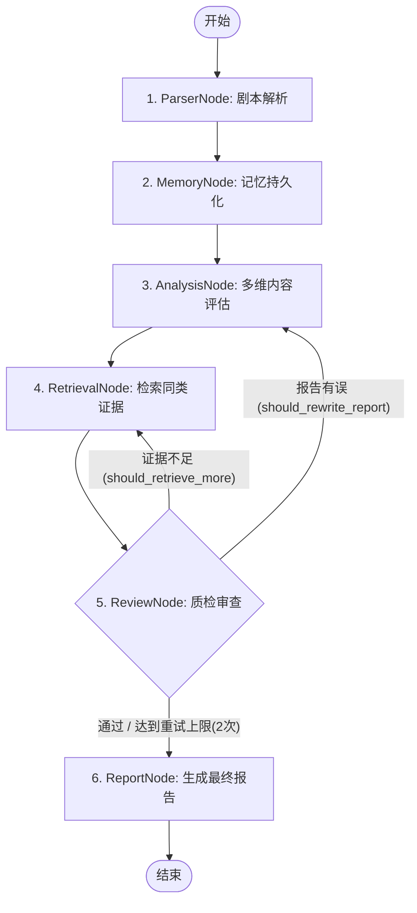

# 剧本评估 Agent 系统 (后端骨架与最小可行版本)

本项目是面向影视、短剧内容立项决策的智能评估系统后端骨架。通过多 Agent 协同流，对剧本文本进行深入解析，抽取关键信息，结合 RAG 对比进行风险把控，并生成具有逻辑依据的最终评估报告。

---

## 1. 项目目标与定位

本项目为 **B端决策辅助工具原型**。通过结构化输出与审评质检循环，辅助内容团队筛选优质剧本。

### Agent 节点与职责

- **Parser Agent（解析抽取节点）**：
  * **核心职责**：**只从剧本文本中抽取事实，坚决不做主观质量评价。**
  * **提取内容**：提取角色人设特征（`CharacterProfile`）、人物关系描述（`character_relations`）、核心戏剧冲突（`core_conflict`）以及包含原文支撑引用的剧情事件序列（`PlotEvent`）。
  * **红线约束**：绝不在其输出的 `ScriptAnalysis` 中添加任何带有“市场潜力巨大”、“商业价值高”、“节奏拖沓”等主观偏见判断的言论。主观维度的风险控制与优缺点交由后置的 `Analysis Agent` 权责管理。

- **Analysis Agent（评估分析节点）**：
  * **核心职责**：基于 Parser Agent 提取的客观元素、`CharacterMemory` 人设设定库以及 RAG 检索回的 `RetrievalEvidence` 同类对标作品，进行多维度的客观质量评估，打出 1~5 范围内的精细化评分。
  * **评估约束**：
    1. **有据可依**：在执行摘要（`executive_summary`）中为每一项打分（人物人设、剧情逻辑、冲突密度、市场契合）给出详尽的扣分与得分理由，且必须绑定抽取出的原文证据或检索对比证据。
    2. **落地修改建议**：拒绝“加强情感刻画”、“丰富人设”等空泛大词。所有的建议均必须指明具体的修改集数或段落行为（如“在第 1 集结尾增加女主在沈知行书房发现父亲遗留暗号线索的钩子”）。
  * **职责分割**：负责补充更新 `ScriptAnalysis` 报告中的优缺点（`strengths`/`weaknesses`）与政策/成本风险点（`risk_points`），并生成终版评估报告草稿。

---

## 2. 启动与运行方式

### 环境要求
- Python 3.10+
- 推荐使用 `conda` 或 `venv` 虚拟环境

### 本地启动步骤

1. **进入 backend 目录并激活环境**：
   ```bash
   cd backend
   # 激活您的虚拟环境（如 conda activate script-agent）
   ```

2. **安装依赖包**：
   ```bash
   pip install -r requirements.txt -i https://pypi.tuna.tsinghua.edu.cn/simple
   ```

3. **启动 FastAPI 本地服务**：
   ```bash
   uvicorn app.main:app --reload --port 8000
   ```
   启动成功后，API 交互文档地址为：[http://127.0.0.1:8000/docs](http://127.0.0.1:8000/docs)

4. **启动 Streamlit 交互式 Demo 前端页面**：
   另开一个终端，在 `backend/` 目录下激活虚拟环境，并运行：
   ```bash
   streamlit run demo.py
   ```
   启动成功后，可在浏览器中访问：[http://localhost:8501](http://localhost:8501) 进行可视化交互式剧本评估与工作流 Trace 追踪查看。

---

## 3. 测试与评估说明

### 单元与集成测试 (Pytest)
在 `backend/` 目录下运行测试：
```bash
python -m pytest
```
测试会覆盖数据结构校验、Parser Agent 事实提取机制、异常请求处理、接口返回类型以及核心工作流的状态流转。

### 运行多机制对比评估脚本 (Eval)
我们提供了一个用于系统化离线评测的基准测试模块。

> [!WARNING]
> **关于评测指标的免责声明 / Warning Disclaimer**：
> 当前系统所有 Agent 节点和工具底层的推理均采用 Mock LLMs（启发式规则和模拟延迟）进行，因此评估报告中产出的指标（如平均延迟 `avg_latency_ms`、对标精准度 `evidence_precision` 等）**仅用于流程闭环与数据结构验证**。它们仅体现系统各模式的工程结构差异，并不代表真实生产环境下大语言模型（如 Gemini 或 GPT-4）的真实性能、准确度上限与延迟表现。

#### 1. 运行单模式评估
您可以在 `backend/` 目录下执行以下命令，使用 `--mode` 参数评估指定模式（数据结果输出至 `app/eval/eval_results.json`）：
```bash
# 单 Prompt 直出 Baseline 模式 (single_prompt)
D:\ANACONDA\envs\script-agent\python.exe -m app.eval.run_eval --mode single_prompt

# 固定顺序流工作流模式 (fixed)
D:\ANACONDA\envs\script-agent\python.exe -m app.eval.run_eval --mode fixed

# Hybrid Agent 自环纠错工作流模式 (hybrid)
D:\ANACONDA\envs\script-agent\python.exe -m app.eval.run_eval --mode hybrid

# Hybrid Agent 工作流 + ToolRouter 校验鉴权模式 (hybrid_with_tools)
D:\ANACONDA\envs\script-agent\python.exe -m app.eval.run_eval --mode hybrid_with_tools
```

#### 2. 运行全模式比对
一键运行以上所有模式，并在控制台渲染指标对比对照表，同时将报告导出至 `app/eval/eval_report.md`：
```bash
D:\ANACONDA\envs\script-agent\python.exe -m app.eval.compare_modes
```

---

## 4. API 接口调用示例

### 接口 1: 健康检查
- **地址**: `GET /health`
- **返回**:
  ```json
  {"status": "ok"}
  ```

### 接口 2: 剧本解析（仅提取事实）
- **地址**: `POST /parse`
- **请求载荷 (ScriptInput)**:
  ```json
  {
    "project_id": "proj-101",
    "title": "林晚复仇记",
    "raw_text": "女主林晚，男主沈知行，两人契约婚姻，女主为了查清父亲死亡真相复仇。",
    "genre": "都市"
  }
  ```
- **返回格式 (ScriptAnalysis)**: 仅包含角色人设与事件事实的结构化数据，风险及优缺点字段均为空。

### 接口 3: 剧本立项决策评估
- **地址**: `POST /evaluate`
- **请求载荷 (ScriptInput)**:
  ```json
  {
    "project_id": "proj-901",
    "title": "破晓行动",
    "raw_text": "代号风影的特工林啸正在秘密追查跨国财阀首脑赵乾的走私线索，苏晴进行黑客配合...",
    "genre": "悬疑"
  }
  ```
- **返回格式 (FinalReport)**: 符合最终评估强校验结构的 JSON，其中包含打分评分（1-5）、RAG 检索证据列表以及 Review 审核纠错整改项。

---

## 5. 当前阶段局限性说明

具体详情请参阅文档：[limitations.md](docs/limitations.md)
- 所有推理均为 Mock，不消耗大模型 Token；
- RAG 知识库基于本地 JSON 文件；
- 记忆模块支持 JSON 文件持久化，但在多并发高负载场景下未加文件锁防死锁保护。

---

## 6. 系统记忆模块设计说明

为了在影视项目的长周期多轮修改与评估中保持人物设定、戏剧冲突以及个性化用户偏好的一致性，系统设计了双重记忆存储架构：

### 1. 项目决策记忆 (ProjectMemoryStore)
* **存储位置**：`backend/storage/project_memory.json`
* **功能**：归档每次对特定项目评估产出的 `FinalReport`。支持多轮评估的版本保存（`save_project`）、特定字段的局部更新（`update_project`）和列表导出，供 `/projects/{project_id}` 接口进行历史报告还原。

### 2. 角色人设记忆 (CharacterMemoryStore)
* **存储位置**：`backend/storage/character_memory.json`
* **功能**：由 `Parser Agent` 在完成角色事实抽取后批量持久化写入。能够跨评估节点锁定特定角色的动机（`motivation`）、性格标签（`personality`）和关系说明。支持特定项目下单一人物人设属性的更新（`update_character`），有效防范多轮评估中角色名混淆与背景设定崩塌。

---

## 7. 本地 RAG 检索设计说明

为了向评估结论提供有据可依的客观对比，系统实现了一个纯 Python 轻量级本地 RAG 检索器：

### 1. 算法工作原理
* **字符级 TF-IDF 余弦相似度**：在加载 `reference_works.json` 数据库后，系统实时构建字符级文档频率索引并计算 IDF。对输入的检索 Query 进行字符分词后，通过计算其余弦夹角获得基础文本匹配度分数。
* **题材与标签 Boost 加成**：如果检索 Query 完美包含了目标作品的 `genre`（题材）或命中其 `tags`（标签列表），会触发对应分值（最高 0.7）的 Boost 奖励分数叠加。
* **数据归一化**：最终的匹配度评分（`score`）限制在 0.0 至 1.0 区间。

### 2. 证据论证说明（非抄袭检测）
检索返回的 `RetrievalEvidence` 会由 `Retrieval Agent` 注入评估报告，仅作为“同题材立项成功/失败市场比对依据”或“戏剧冲突对标参考”。本模块不作任何法律层面的抄袭判定或相似度指控声明。

---

## 8. Hybrid Agent Workflow 工作流设计说明

为了保证剧本评估的关键业务环节不被遗漏，并兼顾在特定阶段（如检索不全、质检不合格）的灵活回退修正，系统设计并实现了 **Hybrid Agent Workflow（混合 Agent 工作流）** 状态机：

### 1. 确定性外层流程 (Outer Deterministic Flow)
外层工作流是一个确定性的顺序流程，首个生命周期严格按照以下顺序执行各节点，不被模型随意跳过：
1. **ParserNode**：解析并抽取剧本角色与事件要素；
2. **MemoryNode**：将抽取的人物与项目初始信息注册进入持久化记忆库；
3. **AnalysisNode**：多维度评估剧本质量、亮点和风险，生成报告草稿；
4. **RetrievalNode**：利用 TF-IDF 与题材 Boost 检索本地同类对标作品作为证据；
5. **ReviewNode**：独立核对评估草稿中的逻辑、幻觉和证据质量；
6. **ReportNode**：锁定并输出最终校验格式报告。

### 2. 局部补充自环修正 (Inner Correction Loop)
在 `ReviewNode` 质检过程中，内层逻辑通过评估报告中的反馈控制标志位控制状态路由回退：
- **打回检索 (`should_retrieve_more == True`)**：当发现检索证据不足或对标不匹配时，打回至 `RetrievalNode`。流转路径：`RetrievalNode` -> `AnalysisNode` -> `ReviewNode`；
- **打回重新分析 (`should_rewrite_report == True`)**：当发现人设冲突或评分无依据时，打回至 `AnalysisNode`。流转路径：`AnalysisNode` -> `ReviewNode`；
- **重试上限保护 (Retry Limit)**：质检迭代最大次数为 2 次。一旦达到重试上限，系统会自动锁定并流转至 `ReportNode` 生成报告，坚决杜绝无限循环。

### 3. 工作流状态图 (Workflow Diagram)


### 4. 节点执行 Trace 追踪记录
为提升工作流透明度和可追溯性，系统使用 `NodeTrace` 数据结构记录每个执行节点，包含：
* `node_name` (节点名称)
* `input_summary` (输入数据摘要)
* `output_summary` (输出数据或状态摘要)
* `errors` (异常/错误捕捉说明)
* `retry_count` (节点所处的重试轮次)

---

## 9. 用户反馈收集与失败案例迭代闭环 (Feedback & Failure Case Loop)

为了实现 Agent 系统的自我迭代和无回归优化，系统构建了**用户反馈收集 (Feedback Collector)** 与**失败案例库 (Failure Case Store)**。

### 1. 闭环流转架构
1. **反馈收集**：用户通过接口或页面提交对报告的评分和修改评论（Pydantic 校验的 `FeedbackInput`）。
2. **失败案例自动判定**：反馈收集器 (Collector) 综合用户反馈、Review Agent 问题项和 Trace 链路状态。若满足以下条件之一，则自动将该次评估沉淀为 `FailureCase`，持久化至 `backend/storage/failure_cases.json`：
   - 用户反馈 `helpful == False` 或 `evidence_accurate == False`；
   - 用户反馈的 `wrong_claims` 非空；
   - Review 模块检出严重级别（severity == HIGH）的质量缺陷；
   - 链路 Trace 中存在 `FAILED` / `FALLBACK` 状态事件。
3. **案例重放与回归**：重放引擎 (Replay Engine) 提取失败案例并加载其对应的原始 `ScriptInput`（项目启动时已自动持久化于 `backend/storage/script_inputs.json`），完全重新执行评估工作流。
4. **系统优化依据**：开发人员可以通过重放失败案例来测试和微调 Prompt 模板、Rerank 检索权重或 Review 规则，从而在零回归的保障下，不断提升 Agent 系统的评估精准度与稳定性。

### 2. 相关接口与数据流
- `POST /feedback`：提交用户对剧本评估报告的反馈。
- `GET /feedback/{project_id}`：检索特定项目的历史用户反馈记录。
- `GET /failure-cases`：获取所有记录的失败案例列表。
- `GET /failure-cases/{case_id}`：根据唯一 ID 检索指定的失败案例诊断详情。
- `replay_failure_case(case_id)` 方法：编程方式触发重放，以便在流水线或调试中重现缺陷。

---

## 10. Eval 评估指标设计与物理意义

为了量化不同剧本评估方案在性能、准确度和稳定性上的优劣，系统定义并计算了 14 个核心的评估指标：

### 1. JSON 成功率 (`json_success_rate`)
* **定义**：计算工作流输出的报告对象转换为合法 JSON，并能成功被 Pydantic `FinalReport` 模型反序列化验证通过的概率。
* **物理意义**：衡量输出数据的结构稳定性和规范性。由于系统有严格的 Pydantic 数据模式（如评分限制在 1-5），该指标越接近 100%，表示系统的结构鲁棒性越高。

### 2. 人物抽取准确率 (`character_extraction_accuracy`)
* **定义**：计算提取出的角色名称集合与黄金标注（Gold Standard）角色集合的 Jaccard 相似度系数。
* **计算公式**：
  \[\text{Accuracy}_{\text{char}} = \frac{|S_{\text{extracted}} \cap S_{\text{gold}}|}{|S_{\text{extracted}} \cup S_{\text{gold}}|}\]
* **物理意义**：评估 Parser Agent 进行实体（人物角色）抽取的覆盖率与精确度。

### 3. 核心冲突准确率 (`core_conflict_accuracy`)
* **定义**：计算提取出的核心戏剧冲突文本与黄金核心冲突文本的字符级别（Character-level）Jaccard 相似度。
* **物理意义**：反映系统在提取故事最主要矛盾时的语义贴合度。

### 4. 证据引用准确率 (`evidence_precision`)
* **定义**：报告中引用的对标证据作品（`evidence_list` 里的标题）命中基准要求的 `expected_evidence_keywords` 的比率。
* **物理意义**：衡量 RAG 检索器为报告匹配合适对标证据的精确性。未引入 RAG 的 Baseline 方案该指标接近 0%。

### 5. 无依据评价比例 (`unsupported_claim_rate`)
* **定义**：最终产出的评估报告中，依然被 Review Agent 独立质检规则诊断出含有 `unsupported_claim`（无依据打分或无对标引用）问题项的报告占比。
* **物理意义**：衡量评估报告的“主观偏见/无依据论证”概率。具有 Review 质检自环修正的 Hybrid 工作流该比例会大幅降到接近 0%。

### 6. 质检缺陷检出率 (`review_issue_detection_rate`)
* **定义**：在测试用例存在逻辑硬伤或对标错误时，工作流顺利触发 Review 质检并记录缺陷问题列表的比率。
* **物理意义**：反映审查机制的参与度和主动检出效率。非自环/无质检方案该指标为 0.0。

### 7. 工作流完成率 (`workflow_success_rate`)
* **定义**：工作流顺利执行到底，各节点在执行中未捕获到崩溃性 Exception 异常的概率。
* **物理意义**：评估系统整体的稳定运行效率。

### 8. 平均工具调用次数 (`avg_tool_calls`)
* **定义**：单次剧本评估流程中，系统通过 Tool Router 或直接调用的外部工具 the 平均次数。
* **物理意义**：衡量各工作流模式下，工具调用体系的活跃度与开销。

### 9. 平均执行延迟/毫秒 (`avg_latency_ms`)
* **定义**：单次剧本评估流程的平均运行耗时（毫秒）。
* **物理意义**：评估各模式在性能和时间开销上的差异。

### 10. 工具降级率 (`fallback_rate`)
* **定义**：工具调用执行失败触发降级机制（Fallback）的概率。
* **物理意义**：评估工具调用链路在面对异常/限制时的鲁棒性与容错能力。

### 11. 平均综合质量得分 (`avg_quality_score`)
* **定义**：结合证据充分性、报告结构完整度、建议可执行性等多维规则计算出的评估报告质量评分平均值 (0-100)。
* **物理意义**：直观反映生成评估报告的合规性与可用度。

### 12. 平均证据得分 (`avg_evidence_score`)
* **定义**：报告引用对标作品证据充分性与无依据断言控制的分数平均值 (0-100)。

### 13. 平均建议可执行得分 (`avg_actionable_score`)
* **定义**：修改建议可落地性、具体性的评估分数平均值 (0-100)，短小或空泛口号建议会引起扣分。

### 14. 平均一致性得分 (`avg_consistency_score`)
* **定义**：报告是否能完美保持人物人设和事实一致性（无矛盾或幻觉）的分数平均值 (0-100)。

---

## 11. 报告质量评分器 (Report Quality Scorer) 设计

系统实现了独立的报告评分规则引擎（位于 `backend/app/quality/scorer.py`），对生成的评估报告从 5 个维度进行硬性质量评分（百分制），旨在为 CI 回归、对比评测和系统迭代提供客观指标支撑。

* **证据充分性 (evidence_score)**：检查对标证据是否为空（-50分），以及质检是否拦截了无支持依据的评价（每个 -20分）。
* **结构完整度 (structure_score)**：核心结构字段（得分、摘要、结论等）必须非空且范围合法，每缺失一项扣 15分。
* **建议可执行性 (actionable_score)**：建议列表为空扣 60分，建议字数过短(<10字符)或属于空泛弱建议，触发扣分。
* **人物剧情一致性 (consistency_score)**：质检如拦截到人设一致性冲突（扣 40分）或事实幻觉（每个扣 30分）进行严厉扣分。
* **风险评估覆盖度 (risk_coverage_score)**：未列出风险点扣 80分，遗漏红线缺陷扣 20分。
* **总质量得分计算**：
  $$\text{quality\_score} = 0.3 \times \text{evidence\_score} + 0.2 \times \text{structure\_score} + 0.2 \times \text{actionable\_score} + 0.2 \times \text{consistency\_score} + 0.1 \times \text{risk\_coverage\_score}$$
  
该模块作为测试与评测的校验基准，有助于分析各种工作流模式下的报告质量短板，用于后续 prompt / retrieval / workflow 方案的精细迭代。

---

## 12. 轻量级内存缓存与成本/时延可观测性设计 (Lightweight Cache & Cost/Latency Observability)

为了减少重复分析、重复检索和重排的系统延迟，并为 B 端客户提供精确的服务开销预估，系统引入了轻量级本地内存缓存机制，并在 Trace Telemetry 中实现了精细化的成本统计。

### 1. 轻量级本地内存缓存 (SimpleCache)
* **实现方案**：系统在 `backend/app/cache/simple_cache.py` 中实现了一个纯内存的带 TTL (Time To Live) 生存时间检查的缓存模块。该模块不依赖于 Redis 或任何第三方数据库服务，做到了零依赖、开箱即用。
* **接入与缓存键 (Cache Key) 策略**：
  1. **ParserAgent**：对剧本原文的 `raw_text` 计算 MD5 哈希作为键。若剧本未发生更改，二次评估时将直接命中缓存并提取已抽取的角色事实与事件要素，**从而免除大模型 API 推理开销**。
  2. **RetrievalAgent**：将检索 query 字符串（包含正文、题材、受众等）拼接并生成 MD5 哈希作为键。若搜索条件不变，二次检索时将直接恢复最终对标结果，**跳过第一阶段召回与第二阶段精排的所有工具调用**。
  3. **Reranker**：将 query 和召回作品列表的所有标题排序后组合，计算 MD5 哈希作为键。保证在相同输入下的相似作品二次重排直接秒出，**降低时延**。

### 2. 成本与时延可观测性统计 (Trace Metrics)
通过在 `TraceRecorder` 与 `calculate_metrics` 中接入缓存命中统计，我们在 `final_report.trace.metrics` 中新增了以下五个关键观测指标：
* `cache_hit_count` (缓存命中次数)：当前评估工作流中从缓存中成功读取的次数。
* `cache_miss_count` (缓存未命中次数)：当前评估工作流中触发实际计算与调用的次数。
* `cache_hit_rate` (缓存命中率)：命中次数除以总缓存请求次数的比率。
* `estimated_llm_calls` (大模型估算调用次数)：系统假设 `ParserNode`、`AnalysisNode` 和 `ReviewNode` 在无缓存时均会向大语言模型发起 API 请求。在发生 Parser 缓存命中时，我们会扣除对应的次数。
* `estimated_tool_cost` (估算服务总成本)：基于以下精细计费模型在运行时动态累加（单位为美元）：
  $$\text{estimated\_tool\_cost} = \text{estimated\_llm\_calls} \times 0.01 + \text{total\_tool\_calls} \times 0.001$$
  当缓存命中增多时，`estimated_llm_calls` 和 `total_tool_calls` 会同步减少，从而直观展现系统的降本增效成果。


