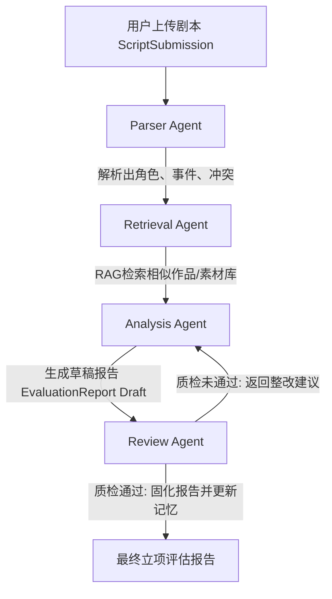

# 系统架构设计文档 (第一阶段)

本系统采用 **Multi-Agent 协同工作流** 与 **RAG 检索增强技术** 构建，旨在实现结构化、可溯源的剧本立项决策评估。

## 1. 核心架构拓扑

系统的整体执行流程如下：

---

## 2. 各 Agent 节点职责划分

- **Parser Agent（解析层）**：
  负责分析剧本大纲或正文，提取核心人物、关系图谱及关键剧本事件。主要关注文本信息的静态提取。
- **Retrieval Agent（信息增强层）**：
  将提取到的题材和冲突关键词作为查询，在参考库中检索同题材、同体量级别已上映/播放作品，提供真实的商业对比依据。
- **Analysis Agent（评估生成层）**：
  结合剧本解析特征与 Retrieval Agent 提供的外部参考依据，生成初始立项草稿报告，初步划分风险点（政策、制作、市场），并给出一个决策结论草案。
- **Review Agent（质检管控层）**：
  对比输入剧本与 draft 报告，检查报告中是否包含空洞、无依据的主观评语、人物设定矛盾以及常识/剧情幻觉。若发现问题，生成修改意见打回，触发 Analysis Agent 的自我修正机制。

---

## 3. 记忆系统运作 (Memory)

- **Project Memory（项目级决策记忆）**：
  在多轮迭代修改或评估中，记录当前项目之前的评估历史，确立立项建议的修改轨迹，帮助决策者追踪剧本是如何一步步优化达到立项标准的。
- **Character Memory（人物设定记忆）**：
  在提取角色并确认人设后，将其归档到 Character Memory。后置的评估模块会调用该记忆，确保在不同章节大纲的多轮分析中，同一个角色的姓名、性格、身份不出现逻辑偏差与混淆。
