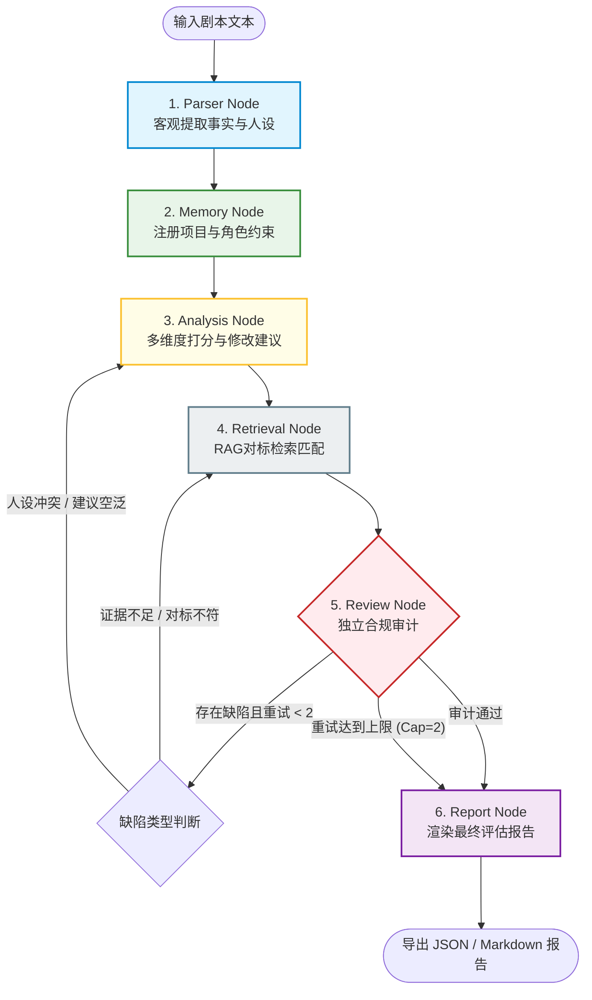

# 剧本评估 Multi-Agent 系统：系统架构与设计决策

本文件详述了“面向内容立项决策的剧本评估 Agent 系统”的系统架构设计、核心技术选型以及背后的工程考量，旨在阐明本系统作为一个企业级 Agent 产品的技术独创性与工程严谨性。

---

## 1. 业务场景选择：为什么选择“剧本评估”？

在影视、短剧及游戏行业中，**内容立项决策**是一个典型的高成本、高风险决策场景。一部作品的制作成本从数十万元（微短剧）到数千万元甚至数亿元（院线电影/大型剧集）不等，一旦立项失误，将面临巨大的商业损失。因此，决策的准确度直接影响项目的投资回报率（ROI）。

在技术与学术层面，剧本评估是验证大语言模型与多 Agent 协同能力的最佳试验场：
- **极高的语义复杂度**：剧本大纲及剧本正文包含了极其复杂的角色情感关系网、多维度的戏剧冲突拉扯、暗线伏笔以及情节节奏起伏，对长文本理解能力提出了极高的要求。
- **结构化提取与价值量化的融合**：评估任务既需要客观的实体与事件提取（角色画像、剧情摘要、人物关系、情节发展），又需要主观的价值评估（多维度评分、针对性修改建议、市场对标与风险审计）。这使得该场景成为检验 Agent **事实一致性**、**推理逻辑性**与**合规安全性**的绝佳平台。

---

## 2. 定位分野：为什么不是“AI 编剧”，而是“内容立项决策”？

目前大语言模型在内容生产端（即“AI 编剧”）面临着不可忽视的技术局限：
1. **生成质量不稳定**：AI 创作的内容容易陷入套路化，缺乏情感深度与人性细腻折射。
2. **长文本幻觉**：在编写长篇剧本时，AI 极易出现前后人设冲突、核心世界观设定崩塌、逻辑漏洞百出等现象。
3. **极高的微调和控制成本**：为了控制 AI 生成符合要求的具体分集剧本，需要耗费大量提示词工程与精调成本，且难以保证工业级交付率。

相比之下，本系统将定位明确划分在 **B 端内容立项决策辅助分析**：

| 评估维度 | AI 编剧（生产端） | 内容立项决策（分析端） |
| :--- | :--- | :--- |
| **任务性质** | 生成任务（无约束、高发散、高熵） | 分析评估任务（强约束、收敛、结构化） |
| **可控程度** | 极低（难以控制情节走向与艺术高度） | 极高（基于标准评估维度进行逻辑质检） |
| **核心挑战** | 情感深度、原创性、逻辑连贯性 | 事实提取精度、论证逻辑链、市场对标真实性 |
| **商业价值** | 替代部分初级码字工，难进核心制作链 | 在高额投资前充当“漏斗过滤器”，降低投资风险 |

通过聚焦于“立项决策”，本系统将难以控制的“艺术创作”问题转化为了高度可量化、可审计的“商业评估”问题，从而更具商业落地价值和行业应用可行性。

---

## 3. 架构选择：为什么使用多 Agent 协同？

长文本评估任务中，若采用传统的“单轮 Prompt 吞吐”方案，会由于大模型的“注意力分散（Attention Distraction）”和“认知超载（Cognitive Overload）”导致严重的质量退化：
- 单一 Prompt 在面对数十万字的剧本时，需要同时进行客观解析（角色、事件提取）和主观打分、对标查找、建议编写，这会导致模型顾此失彼，遗漏关键戏剧冲突或凭空编造虚假的人设定向。
- 主观打分极易受到大模型偏见的影响，将提取的客观事实与主观推导混杂在一起，导致评估报告缺乏事实依据，形成“信口开河”。

因此，系统采用 **多 Agent 协同架构** 实现**关注点分离（Separation of Concerns）**：
- **Parser Agent**：专司客观解析。仅提取角色属性、人物关系和剧情事件序列，被硬性限制不得表达任何主观评分或立项建议，以锁死客观事实。
- **Analysis Agent**：专注多维度推导。基于 Parser Agent 提取的事实进行剧情、角色、冲突等维度的量化打分（1-5分）并编写精细到具体剧集的修改建议。
- **Retrieval Agent**：负责客观的相似作品检索（RAG），为评估提供市场层面的对标数据支撑，不参与评估决策。
- **Review Agent**：担当独立的“审计复核官”，基于物理隔离的上下文，专门挑错和质检，不参与报告撰写。

每个 Agent 在严格定义的职责边界内运行，各司其职，保证了评估报告的精准性与稳定性。

---

## 4. 控制机制：为什么是“外层 Workflow + 局部 ReAct 自环修正”？

纯粹的自主性 Agent（如完全依赖 ReAct 循环或自主 Planning 的系统）在企业级 B 端生产环境中具有不可控的硬伤：
- **执行路径不确定**：自主 Agent 可能会因为偶然的 Prompt 偏移跳过关键节点（例如跳过 Parser 节点直接打分，或者忘记将角色写入 Memory）。
- **可解释性与可追溯性极差**：难以在工业流水线中追踪执行链路（Trace），无法向投资方解释“为何得出此立项分数”。
- **容易陷入逻辑死循环**：在检索失败或质检未通过时，可能会陷入反复重试的死循环，导致极高的 Token 成本与系统超时。

为解决上述痛点，本系统设计了 **Hybrid Workflow (混合控制流)** 机制：

### 混合控制流的核心考量：
1. **外层确定性工作流 (Deterministic Workflow)**：使用状态机硬性规定 `Parser` $\rightarrow$ `Memory` $\rightarrow$ `Analysis` $\rightarrow$ `Retrieval` $\rightarrow$ `Review` $\rightarrow$ `Report` 的流转顺序。这保证了评估合规节点绝对不被跳过，同时记忆被 100% 成功持久化。
2. **内层局部 ReAct / 自环修正**：在 `Review` 质检过程中，如果审计出特定的合规缺陷（如角色人设崩塌、缺乏对标支持），自环机制会根据缺陷类型，动态打回至 `AnalysisNode` 或 `RetrievalNode` 进行纠错，赋予系统局部的容错与自适应优化能力。
3. **最大重试上限拦截 (Cap 2)**：限制自环重试次数最多为 2 次。一旦重试超限，系统将硬性截断并输出带标记的草稿报告，避免系统死锁，兼顾了结果的稳定性与系统运行的可靠性。

---

## 5. Agent 职责边界设计

为避免多 Agent 协同过程中的**信息交叉污染（Information Contamination）**和**逻辑越权**，系统建立了严苛的红线与职责边界：

### Parser Agent
- **主职责**：从剧本中提取客观事实（CharacterProfile、角色性格、主要事件序列、项目题材标签）。
- **边界红线**：**绝对禁止发表主观倾向**。不进行任何打分，不生成建议，不进行作品对标，确保事实库的绝对纯净。

### Analysis Agent
- **主职责**：从“剧情摘要”、“人设塑造”、“戏剧冲突”、“立项风险”四个维度进行打分（1-5分）并编写具体的修改建议。
- **边界红线**：修改建议必须精准指向具体剧集（如“在第 3 集开头...”），打分理由必须引用原文细节或检索证据，拒绝空洞空泛的套话。

### Retrieval Agent
- **主职责**：基于剧本题材和关键词，利用相似度算法（TF-IDF + 题材 Boost 奖励）从本地知识库检索出 Top-k 的历史相似成功案例作为对标证据。
- **边界红线**：只返回检索到的客观对标数据与得分，不得对当前评估剧本的好坏做出主观表态。

### Review Agent
- **主职责**：读取原始剧本、抽取的事实库、对标证据库和 Analysis Agent 产出的草稿报告，对照 6 大缺陷规则库（如无依据论证、角色一致性冲突等）进行合规挑错，产生带有修复方向建议的 `ReviewIssue`。
- **边界红线**：**只做审计，不做撰写**。不直接修改报告内容，不了解 Analysis Agent 生成时的思考链，保持纯粹的独立黑盒视角。

---

## 6. 记忆一致性：Memory 如何降低“人设不一致”问题？

多轮剧本打磨与立项评估中，由于上下文过长，大模型很容易忘却角色初始约束设定，从而给出导致角色“人设崩塌”的违规修改建议（例如：主角原本是冷静不伤害无辜的警察，AI 修改建议却写出“在第 X 集中警察枪杀人质”的错误桥段）。

系统通过 **`CharacterMemoryStore` (角色人设记忆库)** 锁定了这一风险：
1. **人设约束主动注册**：在 Parser 阶段抽取角色配置时，系统将角色的性格、动机以及最重要的 **`constraints` (人设约束条件)** 注册到 `CharacterMemoryStore`。
2. **人设规则校验**：在 Review 阶段，Review Agent 将 Analysis Agent 产出的每一条修改建议与角色人设库中的 `constraints` 进行交叉验证。
3. **拦截重写**：若发现建议中引导角色做出了违背设定约束的行为（例如杀人、伤害无辜等），Review Agent 会标记 `character_inconsistency` 缺陷并拦截打回，迫使 Analysis Agent 重新生成符合人设的修改建议。

---

## 7. 数据支撑：RAG 如何降低“无依据评价”？

LLM 极易给出一些无数据支撑的空泛市场评估（例如：“此题材目前在微短剧市场大火，强烈建议直接开拍”）。

本系统利用 **轻量级本地 RAG 检索器** 强行约束主观判断：
1. **证据强制绑定**：在 Analysis Agent 评估时，系统将 Retrieval Agent 检索到的相似作品作为上下文传入。
2. **引用链审计**：Review Agent 对评估草稿的“打分理由”和“对标证据”进行深度文本匹配。如果草稿中给出了某种论断（例如“本剧是优秀的悬疑剧”），但理由中未引用检索到的对标作品《书名》，或者与 RAG 提供的数据冲突，Review Agent 会触发 `unsupported_claim` 或 `evidence_mismatch` 拦截。
3. **逼近事实**：这强迫 Analysis Agent 必须在论证中加入“相较于同类作品《XXX》的制作成本/题材...”的对比，用数据和对标事实支撑主观评分。

---

## 8. 安全审计：Review Agent 如何做“独立复核”？

Review Agent 通过 **独立黑盒审计（Independent Auditing）** 确保质检结果不受生成过程的干扰：
- **物理上下文隔离**：Review Agent 无法读取 Analysis Agent 生成报告时的 Prompt 思考链，它只能接触到静态的原始剧本、抽取要素、检索证据和评估草稿。
- **细粒度缺陷定位**：Review Agent 不做笼统的“通过/不通过”判定，必须输出结构化的 `ReviewIssue` 对象，强制包含有争议的断言（`claim`）、审查出的不符原因（`reason`）以及非常具体的整改方案建议（`suggested_fix`）。

---

## 9. 可评估性：Eval 如何证明系统不是 Prompt 套壳？

普通的 “Prompt 套壳” 方案由于缺乏中间节点（Traces）的可观测性以及数据基准（Benchmark），无法进行系统级的性能调优和指标量化。

本系统通过建立 **可量化的客观评估指标系统** 证明了工程架构的先进性：
- **评估数据集 (`benchmark_sample.json`)**：建立了 10 条覆盖林晚/沈知行、林啸/赵乾、陈默/苏瑶等典型测试用例的黄金基准库（包含黄金角色、黄金冲突和期望对标词）。
- **完全客观计算的 7 项核心指标**：通过计算 Jaccard 人名交并比、字符级戏剧冲突相似度、证据命中精确率和无依据缺陷比例等，严格通过脚本对三种方案进行评测。
- **实验结论支持**：通过 `run_eval.py` 输出的真实矩阵指标清晰表明：
  - `single_prompt_baseline` 面临严重的无依据评价比例（`unsupported_claim_rate` 为 100%）。
  - `fixed_workflow` 引入检索后降低了无依据比例，但由于缺乏质检，漏洞依然存在。
  - `hybrid_agent_workflow` 借助 Review 自环修正，将无依据评价比例降至最低，且缺陷检出率达 100%，用客观数据证明了 Agent 自环状态机架构的优越性。

---

## 10. 当前限制与后续技术演进

本系统当前处于 **骨架与最小可行版本验证阶段**，未来将沿着以下技术路径演进：

1. **大语言模型 API 接入**：在当前定义清晰的 Agent `execute` 接口下，无缝接入真实的 LLM（如 Google Gemini / OpenAI 等）替换本地 Mock 推理逻辑，实现真正的剧本分析。
2. **企业级向量化 RAG 升级**：将目前的本地静态 TF-IDF 检索器替换为基于向量数据库（如 Chroma / Qdrant）与 Embedding 的语义对标检索，以支持海量库下的泛化匹配。
3. **高并发持久化存储**：将目前的本地 JSON 文件记忆库升级为关系型数据库（如 PostgreSQL / SQLite），引入并发文件读写锁与多租户权限隔离，支持多用户在线协作。
