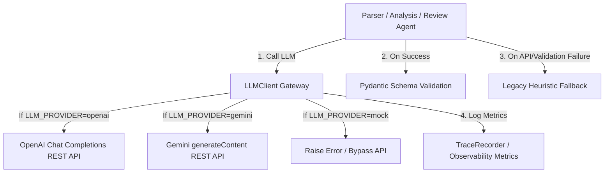

# Real LLM Integration Plan

This plan details the design and implementation for integrating real Large Language Models (LLM) into the `script-evaluation-agent` platform. It describes how the Parser, Analysis, and Review agents will be upgraded to support both mock and real LLM modes via environment variables, with a resilient fallback mechanism to existing heuristics.

## 1. System Architecture

## 2. Environment Variables & Configuration

The system will leverage standard environment variables to toggle modes and configure API access:

* `LLM_PROVIDER`: Toggles the active LLM provider. Supported options: `mock` (default), `openai`, `gemini`.
* `OPENAI_API_KEY`: API Key for OpenAI.
* `OPENAI_BASE_URL`: Optional custom endpoint for OpenAI (defaults to `https://api.openai.com/v1`).
* `OPENAI_MODEL`: Model name for OpenAI (defaults to `gpt-4o`).
* `GEMINI_API_KEY`: API Key for Google Gemini.
* `GEMINI_MODEL`: Model name for Gemini (defaults to `gemini-1.5-pro`).

## 3. Implementation Details

### 3.1. Unified LLM Client Component
* **New File**: `backend/app/llm/client.py`
  - Implement `LLMClient` using the pre-installed `httpx` library (no external SDK dependencies).
  - Define `call_model(prompt, system_prompt, response_schema) -> BaseModel` to query the model, request JSON outputs, strip Markdown code blocks, parse raw JSON, and validate against a target Pydantic schema class.
  - Automatically report `llm_provider`, `llm_model`, increment `llm_calls`, and increment `llm_fallback_count` inside the active `TraceRecorder` context.

### 3.2. Telemetry & Metrics Upgrades
* **File**: `backend/app/observability/trace.py`
  - Add attributes to `TraceRecorder`: `llm_provider: str = "mock"`, `llm_model: str = "mock"`, `llm_calls: int = 0`, and `llm_fallback_count: int = 0`.
* **File**: `backend/app/observability/metrics.py`
  - Update `ObservabilityMetrics` schema and `calculate_metrics` calculation logic to accept and compile the four new LLM-related parameters.
* **File**: `backend/app/workflow/graph.py`
  - Pass the new LLM parameters from `recorder` into `calculate_metrics` when compiling workflow results.

### 3.3. Agent Upgrades & Heuristic Fallback
* **File**: `backend/app/agents/parser_agent.py`
  - Attempt to invoke `global_llm_client.call_model(...)` with `ScriptAnalysis` schema.
  - In case of failure or mock mode, catch the exception and fall back to the existing rule-based extraction.
* **File**: `backend/app/agents/analysis_agent.py`
  - Relocate rule-based scoring to `_heuristic_evaluate(state, characters_list, retrieved_titles)`.
  - Attempt to call `global_llm_client` to output a valid `FinalReport` draft. Fall back to `_heuristic_evaluate` on error.
* **File**: `backend/app/agents/review_agent.py`
  - Relocate rule-based checks to `_heuristic_review(...)`.
  - Attempt to query the LLM to output checked `ReviewIssue` lists matching the Pydantic schema. Fall back to heuristics on error.

### 3.4. Manual Test Script
* **New File**: `backend/scripts/run_real_llm_demo.py`
  - Write a standalone script that instantiates a test script, configures environment variables, and executes the workflow to output real LLM trace and metrics results.

## 4. Verification and Testing Strategy

1. **Keep Pytest Mocked**: All unit and integration tests will continue to run with `LLM_PROVIDER="mock"` (the default configuration) to ensure no dependency on network calls or API keys during standard test execution.
2. **Robust Fallbacks**: Test that setting `LLM_PROVIDER="openai"` with an invalid API key gracefully triggers fallback heuristics, resulting in correct report generation, zero test crashes, and incremented `llm_fallback_count` telemetry.
3. **Manual Execution**: Run `run_real_llm_demo.py` with real API keys to verify integration with OpenAI or Gemini.
